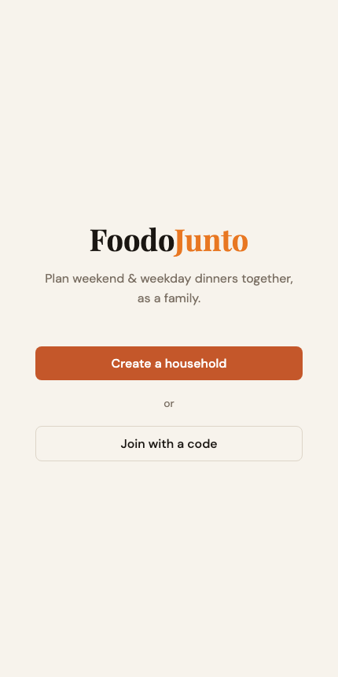
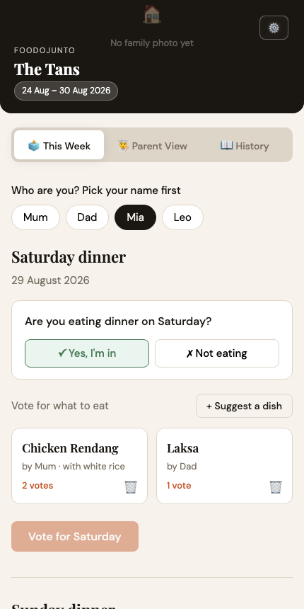
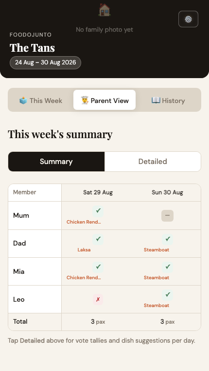

# 🥘 FoodoJunto

**Plan weekend & weekday dinners together, as a family.**

FoodoJunto is a small, installable web app for households who want to decide
"what's for dinner" together — pick your meal days, suggest dishes, vote,
mark who's actually eating, and keep a running history of what you've cooked
(with photos and family ratings). No app store, no accounts, no server to
manage: it's a single static page backed by a free Supabase project.

<p align="center">
  
  
  
</p>

## Features

- **Create a household or join one with a code** — no accounts, no passwords.
  Share a 6-character code with your family and everyone's on the same page.
- **Vote on dinner** — anyone can suggest a dish for a given day; family
  members mark themselves in or out and vote for their favorite.
- **Configurable meal days & types** — weekends only, every day, breakfast /
  lunch / dinner, whatever fits your household.
- **Parent summary view** — a compact grid of who's eating what across the
  week, plus a detailed per-day breakdown and vote tally.
- **Meal history** — log what you actually cooked, attach a photo, and let
  everyone rate it (👍/😐/👎 plus a saltiness/sweetness/richness/spice/
  freshness profile) so you remember what was a hit.
- **Installable PWA** — add it to your phone's home screen for a full-screen,
  app-like experience with offline app-shell caching.

## How it's built

FoodoJunto is intentionally low-tech: **one HTML file** (`index.html`) with
inline CSS and vanilla JavaScript — no build step, no bundler, no framework.
Data lives in [Supabase](https://supabase.com) (Postgres + file storage),
talked to directly from the browser via the `@supabase/supabase-js` client
loaded from a CDN.

This means you can host it absolutely anywhere that serves static files —
GitHub Pages, Netlify, Vercel, Cloudflare Pages, or just a folder on your own
web server.

## Self-hosting

You'll need your own free [Supabase](https://supabase.com) project — this
keeps your family's data yours, and takes about five minutes.

1. **Create a Supabase project** at [supabase.com](https://supabase.com)
   (the free tier is plenty for a household).
2. **Set up the database.** Open your project's **SQL Editor**, paste in the
   contents of [`supabase/schema.sql`](supabase/schema.sql), and run it. This
   creates every table the app needs, along with the two storage buckets it
   uploads family/meal photos to.
3. **Grab your API credentials.** In your Supabase project, go to
   **Project Settings → API** and copy the **Project URL** and the
   **`anon` `public`** key.
4. **Configure the app.** Open `index.html`, find the `CONFIG` block near the
   top of the `<script>` tag, and paste in your values:
   ```js
   const SUPABASE_URL = 'https://xxxxxxxx.supabase.co';
   const SUPABASE_KEY = 'your-anon-public-key';
   ```
5. **Deploy it.** Push the files to GitHub Pages, drag the folder into
   Netlify, or upload it anywhere that serves static HTML. That's it — no
   build step.

If you forget step 4, the app will tell you instead of failing silently —
you'll see a short "isn't configured yet" message on load.

### A note on the data model

FoodoJunto has no login step — a household's join code is a convention the
app enforces in the UI, not a boundary enforced by the database. Anyone
holding your Supabase `anon` key can, in principle, read or write any
household's data directly. `supabase/schema.sql` sets up Row Level Security
policies that reflect this honestly (open access) rather than pretending
otherwise. This is the right trade-off for a lightweight, self-hosted family
tool — just don't reuse the same Supabase project across households you
don't trust each other with, and don't put anything sensitive in it beyond
casual meal planning.

## Contributing

Issues and pull requests are welcome. Since there's no build step, testing
changes is as simple as opening `index.html` in a browser pointed at your own
Supabase project.

## License

[MIT](LICENSE) — do whatever you'd like with it.
